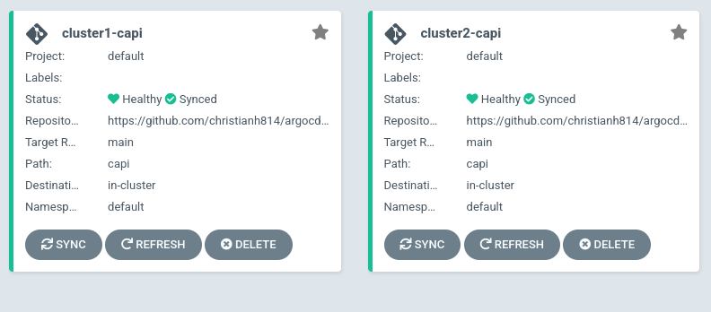
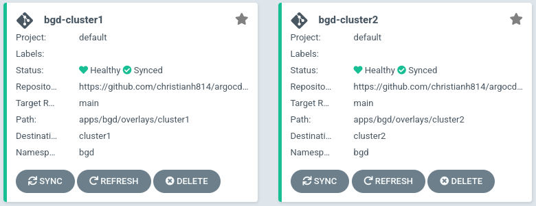

# Argo CD with Cluster API

This demos the ability to create Kubernetes clusters using Argo CD, Argo Workflows, Argo Events, and Cluster API.

## Prerequisites

At a minimum you need

* [KIND](kind.sigs.k8s.io) (and all it's dependecies)
* [`clusterctl`](https://github.com/kubernetes-sigs/cluster-api/releases)

## Create Managment Cluster

You need to create a KIND cluster that will be your management cluster. You first need to set up the configuration.

```shell
cat <<EOF > kind-config.yaml
kind: Cluster
apiVersion: kind.x-k8s.io/v1alpha4
nodes:
- role: control-plane
  extraMounts:
    - hostPath: /var/run/docker.sock
      containerPath: /var/run/docker.sock
EOF
```

Next, use this config to create your KIND cluster

```shell
kind create cluster --config=kind-config.yaml --name=manager
```

Once you see this output, you're good to go.

```
Creating cluster "manager" ...
 ✓ Ensuring node image (kindest/node:v1.23.4) 🖼
 ✓ Preparing nodes 📦  
 ✓ Writing configuration 📜 
 ✓ Starting control-plane 🕹️ 
 ✓ Installing CNI 🔌 
 ✓ Installing StorageClass 💾 
Set kubectl context to "kind-manager"
You can now use your cluster with:

kubectl cluster-info --context kind-manager

Have a question, bug, or feature request? Let us know! https://kind.sigs.k8s.io/#community 🙂
```

You should have a KIND cluster running

```shell
kind get clusters 
```

## Initialize with CAPD

Initialize this cluster with the Docker Cluster API infrastructure provider.

```shell
clusterctl init --infrastructure docker
```

## Install Argo Components

Install Argo Components onto the management cluster

```shell
until kubectl apply -k https://github.com/christianh814/argocd-capi-demo/bootstrap/install/; do sleep 3; done
```

This installs the following

* Argo CD
* Argo Workflows
* Argo Events

Open another terminal tab and run port-forward to get to the Argo CD UI.

```shell
kubectl port-forward -n argocd svc/argocd-server 8080:80
```

Extract the Argo CD password so you can login to the UI as the `admin` user

> :rotating_light: **NOTE** For the purposes of this demo, don't change the Argo CD Admin password

```shell
kubectl get secret argocd-initial-admin-secret -n argocd -o jsonpath='{.data.password}' | base64 -d ; echo
```

**MAKE SURE EVERYTHING IS RUNNING** before trying to apply the ApplicationSets

```shell
kubectl rollout status -n argo-events $(kubectl get deployment -n argo-events -l eventsource-name=webhook -o name)
kubectl rollout status -n argo-events $(kubectl get deployment -n argo-events -l sensor-name=webhook -o name)
kubectl rollout status sts/argocd-application-controller -n argocd
```

Create the `ApplicationSets`

```shell
kubectl apply -k https://github.com/christianh814/argocd-capi-demo/argocd/applicationsets
```

## SUCCESS

You should have (after a few minutes) two Kubernetes clusters running
in KIND.



Also, each one of these CAPI Clusters have a sample workload
running on them.



Running the following...

```shell
kind get clusters
```

Should now show that you have a management cluster and two CAPI Clusters.

```
cluster1
cluster2
manager
```

## Cleanup

Just delete your KIND clusters

```shell
kind delete clusters --all
```
